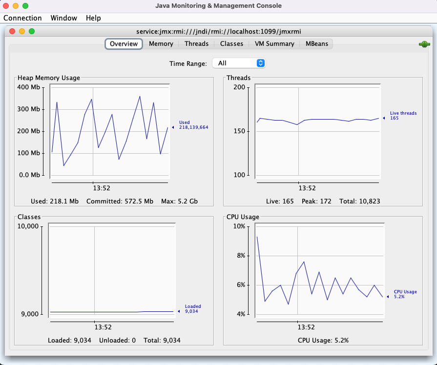
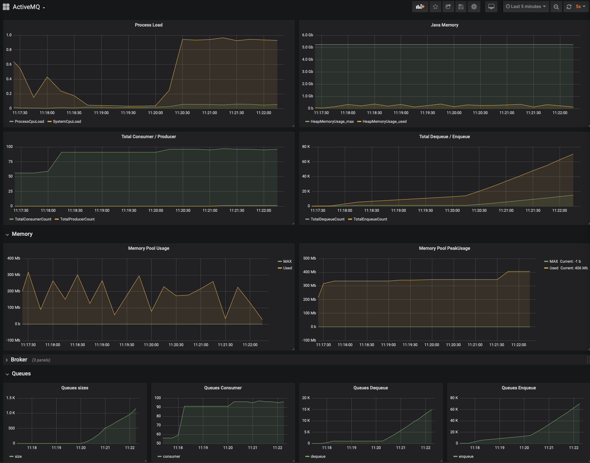

# Monitoring Alfresco Enterprise using ActiveMQ with AIO services

>> Customer credentials for [quay.io/alfresco](https://quay.io/organization/alfresco) Docker Images are required

Alfresco Enterprise 7.4 deployment using Individual services for [Transform Service](https://docs.alfresco.com/transform-service/latest/) and [Search Enterprise](https://docs.alfresco.com/search-enterprise/latest/). Additionally, [Sync Service](https://docs.alfresco.com/sync-service/latest/) is available. 

* Transform Service

  * alfresco/alfresco-transform-core-aio:4.0.0
  * quay.io/alfresco/alfresco-transform-router:2.0.0
  * quay.io/alfresco/alfresco-shared-file-store:2.0.0

* Search Enterprise

  * quay.io/alfresco/alfresco-elasticsearch-live-indexing:3.3.0

* Sync Service

  * quay.io/alfresco/service-sync:3.10.0    


ActiveMQ Web Console is available in http://localhost:8161/ with default credentials `admin/admin`. Following table includes queue and topic messages produced by service.


| Service    | Type   |  Name                                             |
|------------|--------|---------------------------------------------------|
| Repository | TOPIC  | alfresco.repo.event2                              |
|            | QUEUE  | acs-repo-transform-request                        |
|            | QUEUE  | acs-repo-rendition-events                         |
| Transform  | QUEUE  | org.alfresco.transform.ad9cab37-5f02.t-reply      | 
|            | QUEUE  | org.alfresco.transform.engine.aio.acs             | 
|            | QUEUE  | org.alfresco.transform.engine.notUsedByRouter.acs | 
|            | QUEUE  | org.alfresco.transform.engine.t-reply.acs         | 
|            | QUEUE  | org.alfresco.transform.t-request.acs              | 
| Search     | QUEUE  | org.alfresco.search.content.event                 |
|            | QUEUE  | org.alfresco.search.contentrefresh.event          | 
|            | QUEUE  | org.alfresco.search.contentstore.event            | 
|            | QUEUE  | org.alfresco.search.metadata.event                | 
|            | QUEUE  | org.alfresco.search.metadata.retry.event          | 
|            | QUEUE  | org.alfresco.search.path.event                    | 
| Sync       | TOPIC  | VirtualTopic.alfresco.repo.events.nodes           |


## Docker Compose Template

The file [compose.yaml](compose.yaml) includes a sample deployment without async messages production and without ActiveMQ service.

Run the composition using default command.

```
docker compose up
```

**Service URLs**

ACA - http://localhost:8080/workspace/

Share - http://localhost:8080/share

Repository - http://localhost:8080/alfresco/

Transform - http://localhost:8095/

Search - http://localhost:5601/

ActiveMQ - http://localhost:8161/ 

**Credentials**

admin/admin


## Monitoring resources

Several monitoring services are available when using this Docker Compose template.

### JMX (jconsole)

Use following value in `jconsole` Remote Process box:

`service:jmx:rmi:///jndi/rmi://localhost:1099/jmxrmi`

After hitting `Connect` button, following metrics are available:



### Jolokia Metrics

[Jolokia](https://jolokia.org) is available in following URL:

http://localhost:8161/api/jolokia


### Prometheus

Prometheus has been configured using following source http://localhost:8162/metrics

This source is exposed by using `jmx_prometheus_javaagent-0.19.0.jar` Java Agent.


### Grafana 

Credentials: admin/secret

http://localhost:3000

Sample `ActiveMQ` Dashboard is provided.

